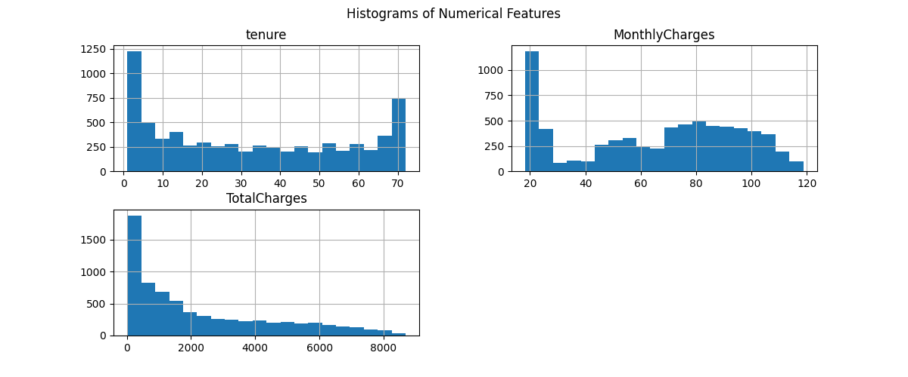
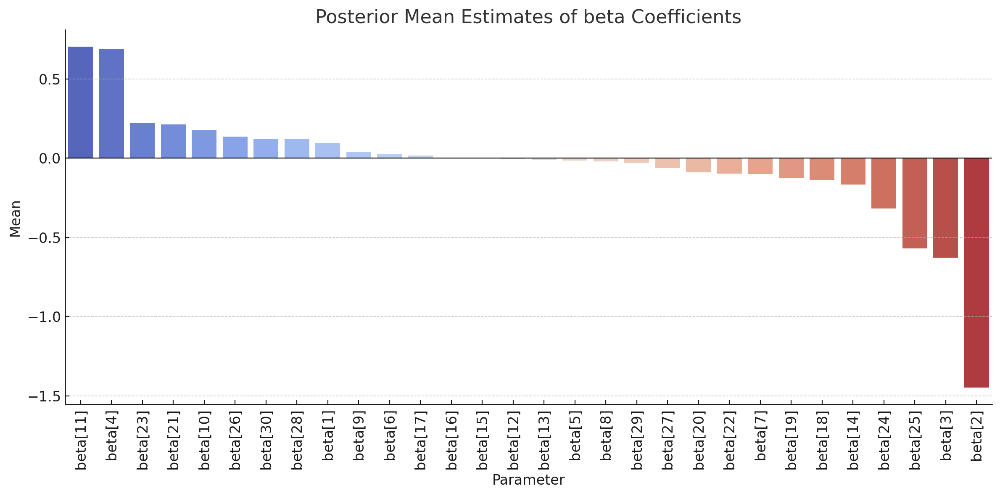

# Customer Churn Prediction with Bayesian Logistic Regression

## 1. Introduction

This report presents a comprehensive analysis of customer churn using a Bayesian logistic regression approach, alongside comparisons with standard logistic regression and random forest models. The primary objective is to understand the influence of different features on the probability of churn and to evaluate the model's performance using probabilistic metrics.

An important methodological choice in this study was to **retain the class imbalance** in the target variable. The dataset inherently contains more non-churned customers than churned ones, reflecting a realistic business scenario. Addressing this imbalance artificially (e.g., via resampling) may lead to misleading inferences and model behaviour; hence, it was preserved to maintain the fidelity of probabilistic modeling and evaluation.

## 2. Data Overview & Class Imbalance

The dataset includes both numerical and categorical features relevant to telecom service usage. Some of the most relevant ones include:

- Demographics: `SeniorCitizen`, `gender`, `Partner`, `Dependents`
- Account information: `tenure`, `Contract`, `PaperlessBilling`, `PaymentMethod`
- Services: `PhoneService`, `InternetService`, `OnlineSecurity`, `StreamingTV`, etc.
- Charges: `MonthlyCharges`, `TotalCharges`

We purposefully retained the class imbalance, shown in the figure below, to reflect real-world churn dynamics where churned customers are naturally the minority.

### Example Feature Distributions Related to Churn:

- **Contract Type**:
  

- **Tech Support**:
  

## 3. Exploratory Analysis

### Numerical Feature Histograms

### Correlation Heatmap

These show that tenure and total charges are strongly related, while many internet service features are also interdependent.

## 4. Bayesian Logistic Regression Modeling

We implemented a Bayesian logistic regression model using CmdStan. The model estimates a posterior distribution for each coefficient β and the intercept α.

### Benefits:
- Uncertainty is explicitly captured.
- Coefficients are interpretable.
- Handles class imbalance without resampling.

### Posterior Mean Estimates of Beta Coefficients:

### Selected Posterior Distributions:

- **Baseline Intercept α**:
  

- **Tenure β[2]**:
  

- **Monthly Charges β[3]**:
  

- **Total Charges β[4]**:
  

- **InternetService_Fiber optic β[11]**:
  

- **Contract_One year β[25]**:
  

- **Contract_Two year β[26]**:
  

These plots show which features are strongly predictive, and with what degree of certainty.

## 5. Model Evaluation

| Metric        | Bayesian Logistic Regression | Random Forest | Logistic Regression |
|---------------|------------------------------|----------------|----------------------|
| ROC AUC       | 0.852                        | 0.832          | 0.831                |
| Brier Score   | 0.133                        | 0.139          | 0.140                |
| Log Loss      | 0.410                        | 0.429          | 0.431                |
| Accuracy      | 0.809                        | 0.808          | 0.790                |
| F1 Score      | 0.612                        | 0.559          | 0.566                |

### Model Comparison Summary:

The Bayesian model outperforms others in most probabilistic metrics while providing interpretable uncertainty estimates.

## 6. Conclusion & Next Steps

The Bayesian logistic regression model:
- Provides interpretable posterior distributions for each predictor.
- Handles uncertainty naturally, which is vital for business decision-making.
- Performs well even on imbalanced data without requiring resampling.

Key insights:
- **Longer tenure** and **contractual commitment** (especially two-year contracts) significantly reduce churn likelihood.
- **Higher total charges** correlate with reduced churn (possibly a proxy for tenure), while **higher monthly charges** increase churn.
- Customers with **fiber optic internet**, **streaming services**, or **electronic check payment** methods show elevated churn probabilities.

Retaining the class imbalance led to more faithful, real-world-applicable probabilities. This decision reflects best practices in Bayesian modeling and helps avoid distortion in model performance and interpretation.

**Follow-up work** will explore the effects of balancing the classes through resampling and perform systematic feature selection to optimize model generalization and interpretability.

---

*This report demonstrates the power of Bayesian inference in churn prediction and lays a strong foundation for future work on customer retention strategies using probabilistic modeling.*
